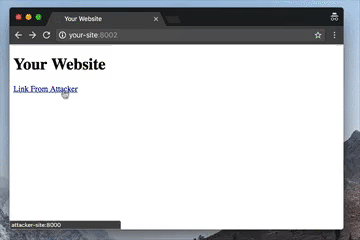

# Unvalidated Redirects

🚨 Always use rel="noreferrer noopener" linking to another site with target="_blank". Or else that site can silently redirect your users!

- [Original Tweet](https://twitter.com/iammerrick/status/914988292637990912)
- [More Details](https://mathiasbynens.github.io/rel-noopener/)
